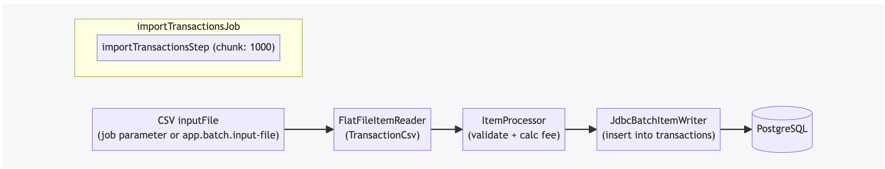
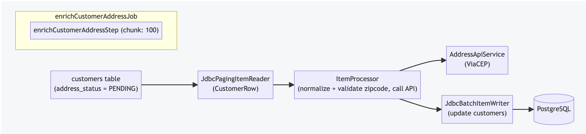
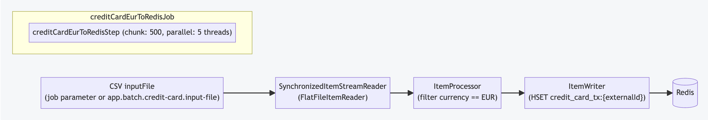

# Spring Batch Playground

## Requirements
- Java 25
- Docker (for Redis and Postgres)

## Database (Docker Compose)
Start Docker services locally:

```sh
docker compose up -d
```

## Gradle
See [GRADLE_README.md](GRADLE_README.md) for Gradle commands (dependencies, running jobs).

## Job Examples

### Import Transactions Job
Imports transactions from CSV files into a database.

Run the job
```sh
./gradlew bootRun --args="--spring.batch.job.name=importTransactionsJob inputFile=classpath:csv/transactions_2026-01-27.csv"
```

### Enrich Customer Address Job
Enriches pending customer addresses via an external ZIP code lookup service.

Run the job
```sh
./gradlew bootRun --args="--spring.batch.job.name=enrichCustomerAddressJob"
```

### Credit Card EUR to Redis Job
Reads credit card transactions, keeps only EUR, and writes to Redis.

Run the job
```sh
./gradlew bootRun --args="--spring.batch.job.name=creditCardEurToRedisJob"
```
