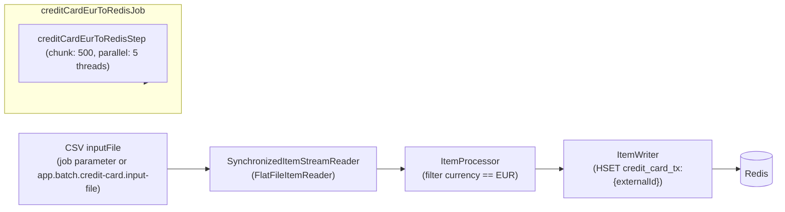

```mermaid
flowchart LR
  subgraph Job["creditCardEurToRedisJob"]
    Step["creditCardEurToRedisStep (chunk: 500, parallel: 5 threads)"]
  end

  Source["CSV inputFile\n(job parameter or app.batch.credit-card.input-file)"]
  Reader["SynchronizedItemStreamReader\n(FlatFileItemReader)"]
  Processor["ItemProcessor\n(filter currency == EUR)"]
  Writer["ItemWriter\n(HSET credit_card_tx:{externalId})"]
  Redis[(Redis)]

  Source --> Reader --> Processor --> Writer --> Redis
  Job --> Step
```
