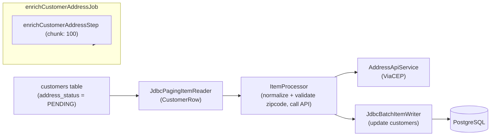

```mermaid
flowchart LR
  subgraph Job["enrichCustomerAddressJob"]
    Step["enrichCustomerAddressStep (chunk: 100)"]
  end

  Source["customers table\n(address_status = PENDING)"]
  Reader["JdbcPagingItemReader\n(CustomerRow)"]
  Processor["ItemProcessor\n(normalize + validate zipcode, call API)"]
  External["AddressApiService\n(ViaCEP)"]
  Writer["JdbcBatchItemWriter\n(update customers)"]
  DB[(PostgreSQL)]

  Source --> Reader --> Processor --> Writer --> DB
  Processor --> External
  Job --> Step
```
