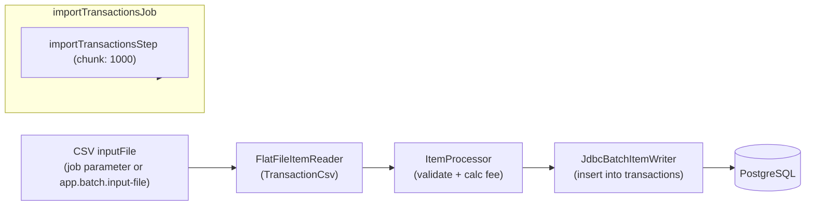

```mermaid
flowchart LR
  subgraph Job["importTransactionsJob"]
    Step["importTransactionsStep (chunk: 1000)"]
  end

  Source["CSV inputFile\n(job parameter or app.batch.input-file)"]
  Reader["FlatFileItemReader\n(TransactionCsv)"]
  Processor["ItemProcessor\n(validate + calc fee)"]
  Writer["JdbcBatchItemWriter\n(insert into transactions)"]
  DB[(PostgreSQL)]

  Source --> Reader --> Processor --> Writer --> DB
  Job --> Step
```